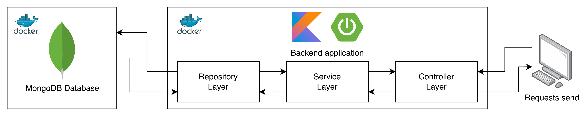

# Blockchain demo - Supply Chain Product Tracking
Research Project in Computer Science course, Vrije Universiteit Amsterdam 2025/2026

## Introduction
This project demonstrates an application of Blockchain technology within a use case of Supply Chain Product Tracking. Blockchain appears like a potential solution to achieve a traceable supply chain information, results in data transparency and avoiding unauthorized alteration of data.

## Use case description
The blockchain implementation of this specific use case aims to store immutable data about product status through the supply chain. Each block of the blockchain represents a step in the supply chain, for example, `Manufactured`, `Packed`, `Collected by Distributor`, `In Transit to Retailer`, `Delivered to Retailer` and `Purchased`.

A simple workflow of this can consist of the following steps:
* **Manufacturing:** First, when the product is made, its information is registered, including production date, batch, item identifier. A new chain is created with the first block of `Manufactured` status.
* **Packing:** Before shipping to retailers, the manufacturer will update the products to `Packed` status and include delivery information.
* **Distributor handling:** The delivery service provider will pick up the products from the manufacturer, update the chain with the `Collected by Distributor` status. Once the shipping process begins, a new block with status `In Transit to Retailer` will be added to the chain data.
* **Retailer Receipt:** Once the retailer receives products from the delivery service, the chain changes to `Retailer` status.
* **Customer Purchase:** When a customer purchases a product, the record will be updated as `Purchased`, marking the end of workflow.

## Implementation
This implementation follows the **Controller-Service-Repository (CSR)** architectural pattern. This pattern clearly separates the responsibilities among the layers, making it comprehensive and maintainable, also supports scalability and reusability.



## Functionalities
There are two types of blockchain APIs that is implemented in this application, one for the generic block data (`Data` class), one for supply chain data (`SupplyChainData` class). The only difference between those are the required data fields. The API endpoints are as follows:
* **Create new blockchain:** `POST /api/blockchain` or `POST /api/supply-chain`
* **Retrieve blockchain information:** `GET /api/blockchain/<id>` or `GET /api/supply-chain/<id>`
* **Add new block to chain:** `POST /api/blockchain/<id>` or `POST /api/supply-chain/<id>` with Body of corresponding data type (`Data` or `SupplyChainData`)
* **Validate blockchain:** `POST /api/blockchain/<id>` or `POST /api/supply-chain/<id>`

## Run the application
Change the settings related to MongoDB in `docker-compose.yml`
```
services:
    mongo:
        environment:
            MONGO_INITDB_ROOT_USERNAME: <username>
            MONGO_INITDB_ROOT_PASSWORD: <password>
    
    blockchain-app:
        environment:
            SPRING_DATA_MONGODB_URI: mongodb://<username>:<password>@mongo:27017/blockchain_db?authSource=admin
```

Simply run the `docker-compose.yml` configuration file using
```console
docker-compose up
```
Once finish testing with
```console
docker-compose down
```
The API can be found by accessing `localhost:8080`.